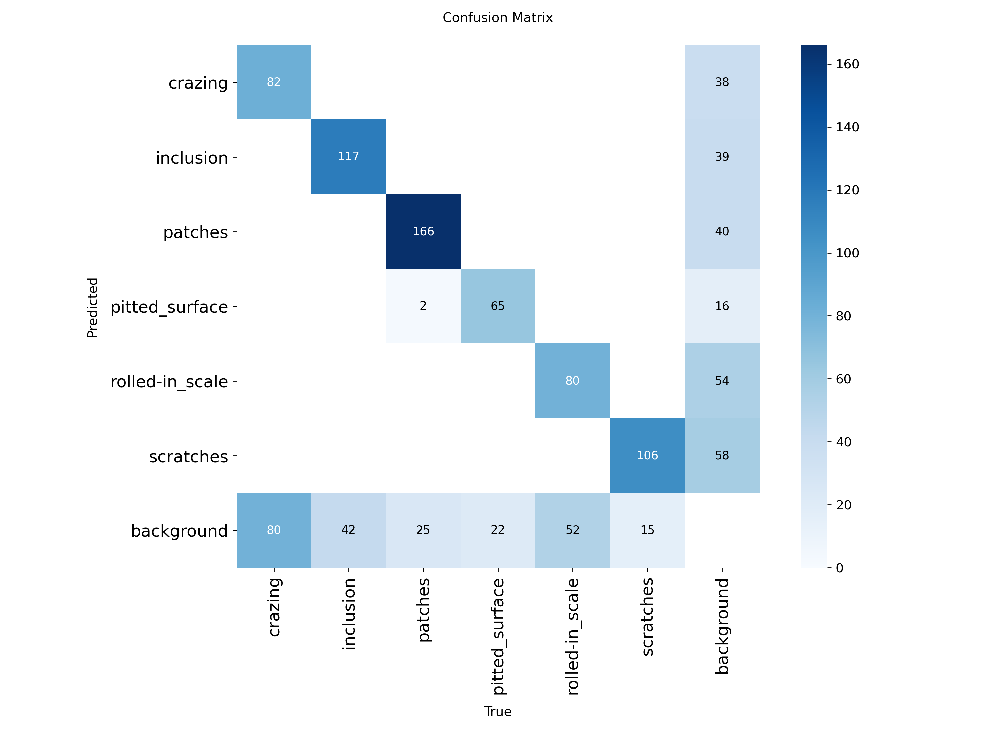
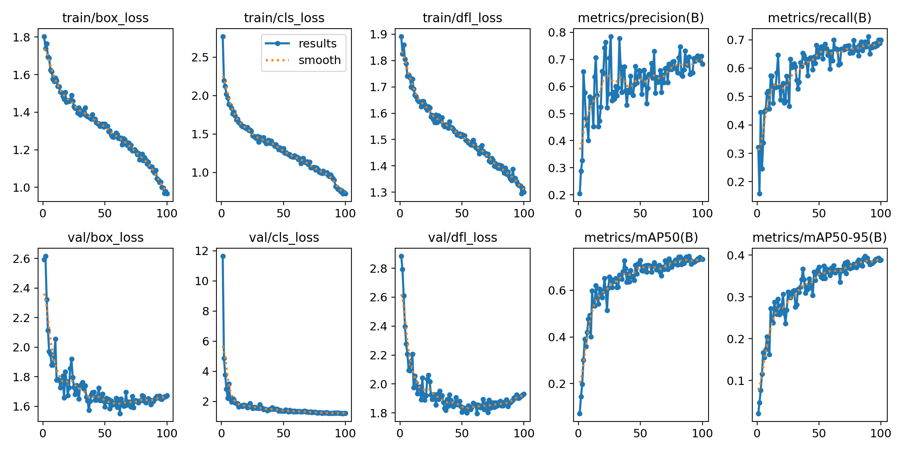
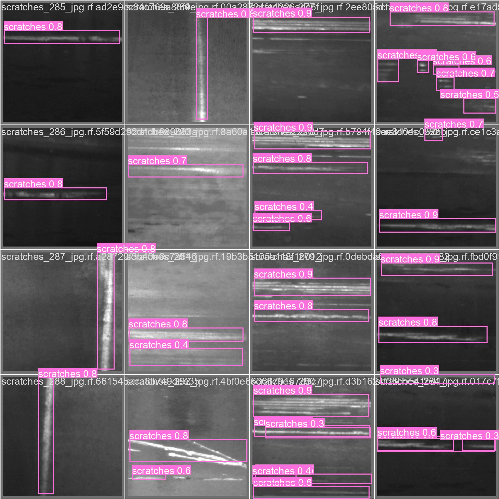

# Metal Surface Defect Inspector using YOLOv8
This project is an attempt of automating quality inspection process in factories. As per the type of manufacturing process like casting, forging , extrusion , etc, we encounter a wide range of defects. As manual inspection is not efficient for a large set of production...a vision based inspection is a more robust solution. 

I built a surface defect inspection system using YOLOv8. I used NEU Surface Defect Dataset(from Roboflow) to train the model. This model works for 6 defect classes: crazing, inclusion, patches, pitted_surface, rolled-in_scale, scratches. 

The system goes beyond just detection — it evaluates defect severity and makes an instant decision (REJECT or FLAG) on each part. It also uses an ROI inspection zone, a standard technique in industrial vision systems, to ensure only detectionsinside the defined inspection area are processed — eliminating false alarms from surroundings.


## Built With

- YOLOv8 (Ultralytics)
- OpenCV
- PyTorch
- NumPy
- Pandas
- Matplotlib
- SQLite
- Google Colab (T4 GPU)

  
## Results

| Metric | Value |
|--------|-------|
| Dataset | NEU-DET (1800 images, 6 classes) |
| Model | YOLOv8m |
| mAP@50 | 74.7% |
| Precision | 78.5% |
| Recall | 71.2% |
| Avg Confidence | 0.73 |


## Defect Classes
There can be a number of defect in manufacturing but all defects are not equally dangerous. A scratch on a steel surface is 
very different from a foreign material embedded inside it. Based on how each defect affects the structural integrity and safety of the final part, we classify them into two severity levels:

**Critical (AUTO REJECT)** — These defects affect the internal structure of the steel. A part with these defects can fail under load or stress in real use. No human judgment needed — the system automatically rejects these.

**Major (FLAG for human check)** — These are surface quality defects. They affect appearance and finish but usually not structural strength. A quality engineer reviews these and decides based on the application — what's rejected for aerospace is acceptable for construction.

| Class | Severity | Decision |
|-------|----------|----------|
| inclusion | Critical | AUTO REJECT |
| pitted_surface | Critical | AUTO REJECT |
| scratches | Major | FLAG |
| crazing | Major | FLAG |
| patches | Major | FLAG |
| rolled_in_scale | Major | FLAG |

## ROI Inspection Zone

In a real factory, a camera sees more than just the part being inspected — it also sees the conveyor belt, robotic arms, workers passing by, background machinery. Without filtering, the model would detect defects on all of these and trigger false reject signals constantly.

This can be solved with an **ROI (Region of Interest) zone** — a polygon drawn on the camera frame that defines exactly where the inspection should happen. Only detections whose centre point falls inside this polygon are processed. 
Thing outside this is ignored .
```
Full Camera Frame
┌─────────────────────────────┐
│  conveyor structure         │
│    ┌───────────────┐        │
│    │  ROI ZONE     │        │
│    │  (inspection  │        │
│    │   happens     │        │
│    │   here only)  │        │
│    └───────────────┘        │
│  background / workers       │
└─────────────────────────────┘
```
**How it works in code:**
1. Define the inspection zone as 4 corner points
2. For every detection, find the centre point of the bounding box
3. Use `cv2.pointPolygonTest()` to check if that centre is inside the polygon
4. If inside → classify severity → REJECT or FLAG
5. If outside → ignore completely, no alert triggered


## System Architecture
```
Camera / Video
      ↓
YOLOv8m Inference
      ↓
ROI Zone Filter  ← only inspect inside defined polygon
      ↓
Severity Classification
      ↓
   REJECT ──→ Reject Signal + Log
   FLAG   ──→ Human Re-check + Log
      ↓
SQLite Database 
```
---

## Training Results





---

## Dataset

[NEU Surface Defect Dataset](https://universe.roboflow.com) — 
1800 images, 6 defect classes, CC BY 4.0 license.

---

